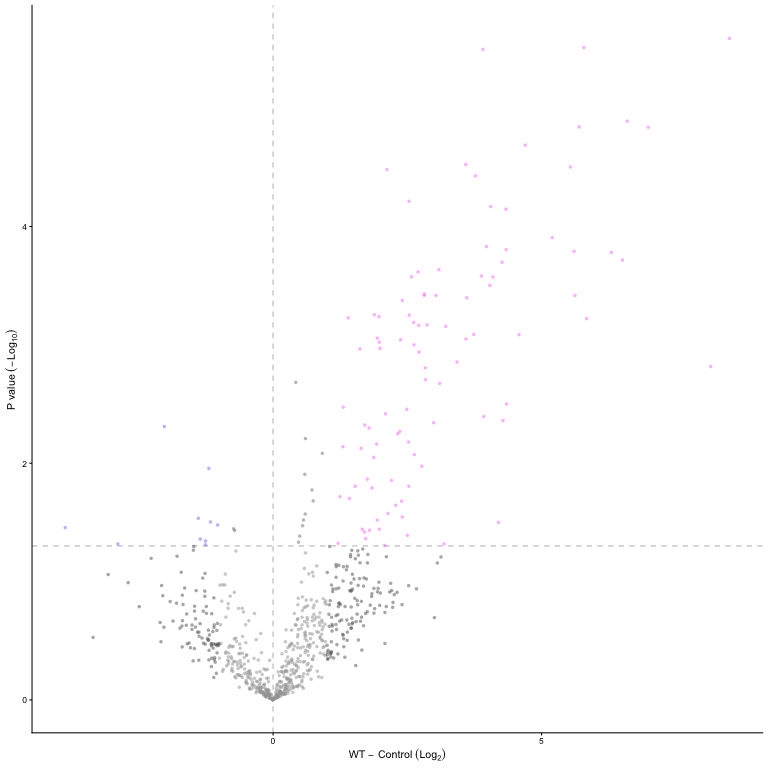

<!-- README.md is generated from README.Rmd. Please edit that file -->

# VolcanoPlotR

<!-- badges: start -->

<!-- badges: end -->

VolcanoPlotR is a way to generate nice volcano plots from MaxQuant data.

## Installation

Install the development version of VolcanoPlotR from
[GitHub](https://github.com/) with:

``` r
# install.packages("pak")
pak::pak("quantixed/VolcanoPlotR")
```

## Example

With a MaxQuant `proteinGroups.txt` placed in a `Data` directory, you
can run the following code to generate a volcano plot:

``` r
library(VolcanoPlotR)
workflow_maxquant()
```

You will be asked which groups you want to compare. Proteins enriched in
Group1 will be towards the right of the plot and those enriched in
Group2 will be towards the left.

An example file is included in the package, so you can run the following
code to see how it works:

``` r
library(VolcanoPlotR)
# get the path to the proteinGroups.txt file included in the package
filepath <- system.file("extdata", "proteinGroups.txt", package = "VolcanoPlotR")
# get the filename fromt the path
filename <- basename(filepath)
# get the directory name
filedir <- dirname(filepath)
# run the automated procedure we will also tell it which groups to compare so
# we don't have to select them interactively
workflow_maxquant(file = filename, datadir = filedir,
                  group1 = "WT", group2 = "Control")
#> Using specified groups: WT versus Control
```



See the vignettes for more information.

## Notes

VolcanoPlotR is a port of
[VolcanoPlot](https://github.com/quantixed/VolcanoPlot) to R.
