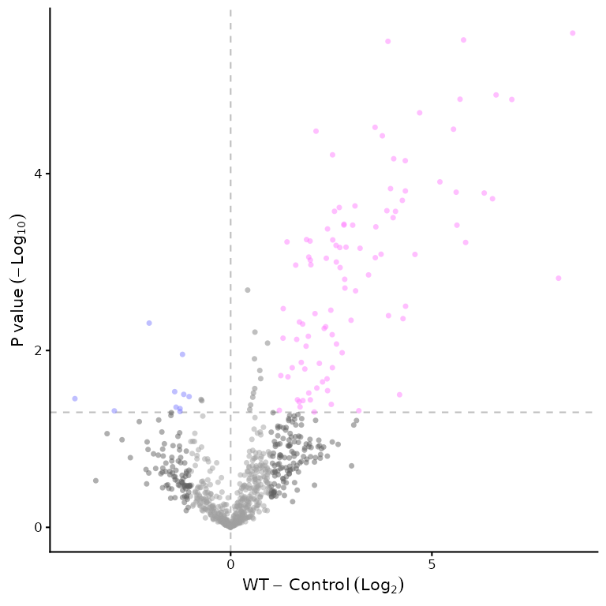

# VolcanoPlotR

## VolcanoPlotR

VolcanoPlotR is a way to generate nice volcano plots from MaxQuant data.

With a MaxQuant `proteinGroups.txt` placed in a `Data` directory, you
can run the following code to generate a volcano plot:

``` r

library(VolcanoPlotR)
workflow_maxquant()
```

You will be asked which groups you want to compare. Proteins enriched in
Group1 will be towards the right of the plot and those enriched in
Group2 will be towards the left.

An example file is included in the package, so you can run the following
code to see how it works:

``` r

library(VolcanoPlotR)
# get the path to the proteinGroups.txt file included in the package
filepath <- system.file("extdata", "proteinGroups.txt", package = "VolcanoPlotR")
# get the filename from the path
filename <- basename(filepath)
# get the directory name
filedir <- dirname(filepath)
# run the automated procedure we will also tell it which groups to compare so
# we don't have to select them interactively
workflow_maxquant(file = filename, datadir = filedir,
                  group1 = "WT", group2 = "Control")
#> Using specified groups: WT versus Control
```



The output is a volcano plot which can be customised further. See the
vignettes for more information.

- Changing colours and plot appearance, including adding labels to
  proteins of interest
  ([`vignette("appearance")`](https://quantixed.github.io/VolcanoPlotR/articles/appearance.md))
- Text output of enriched proteins, alternative statistical tests and
  processing options
  ([`vignette("outputs")`](https://quantixed.github.io/VolcanoPlotR/articles/outputs.md))
- Combining MaxQuant data from multiple experiments and generating a
  volcano plot from the combined data (coming soon)
