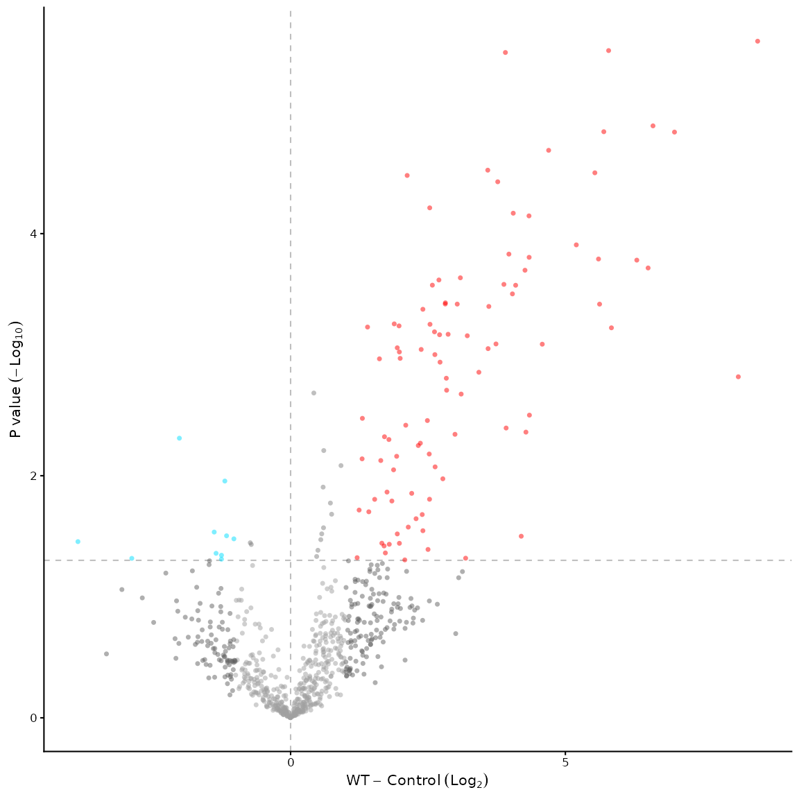
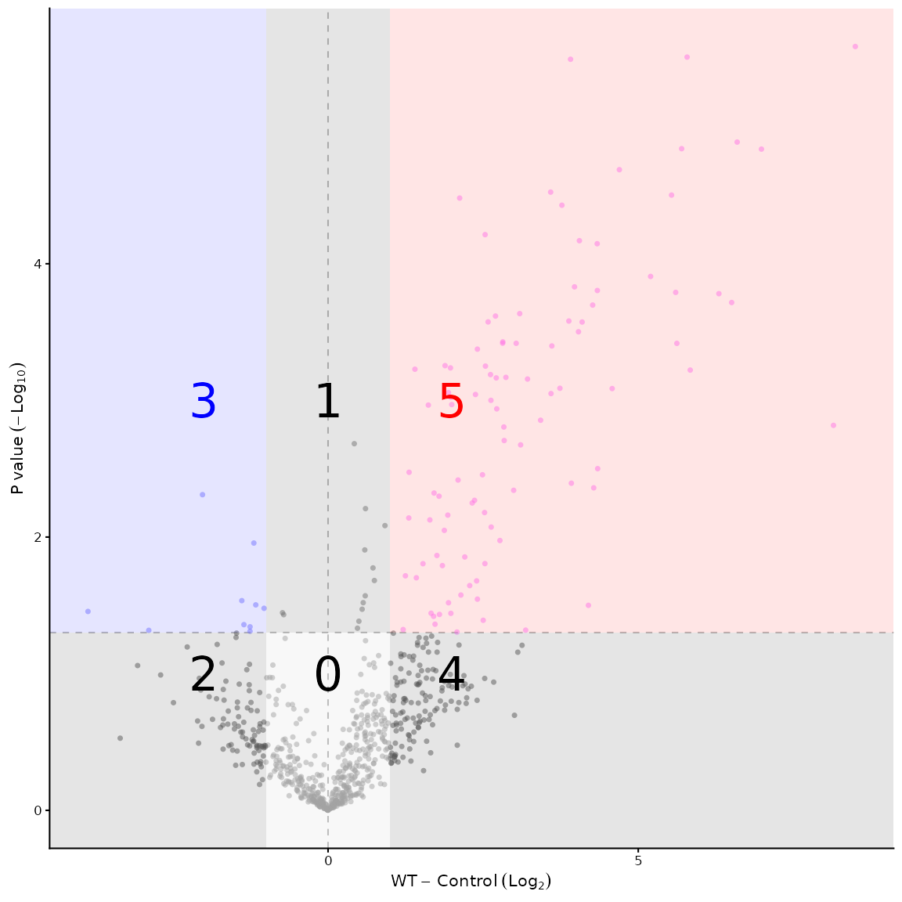
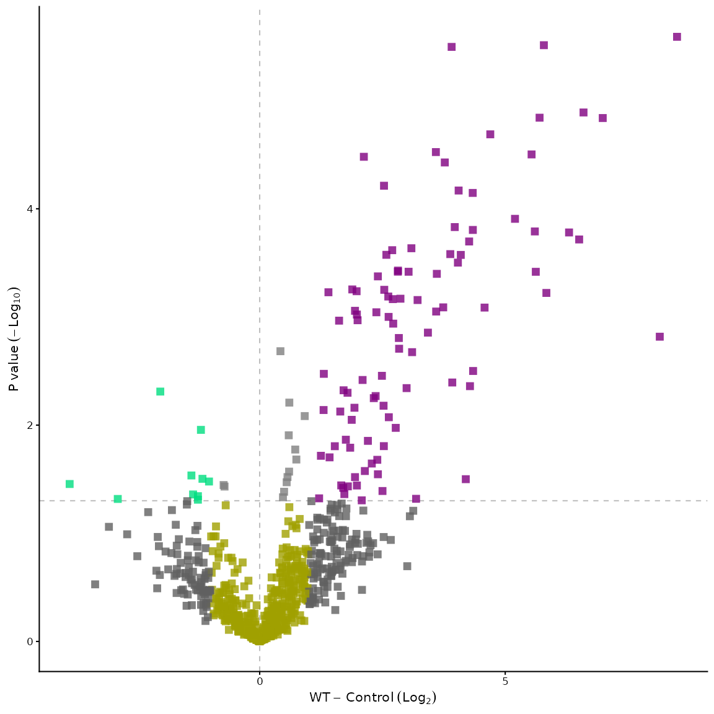
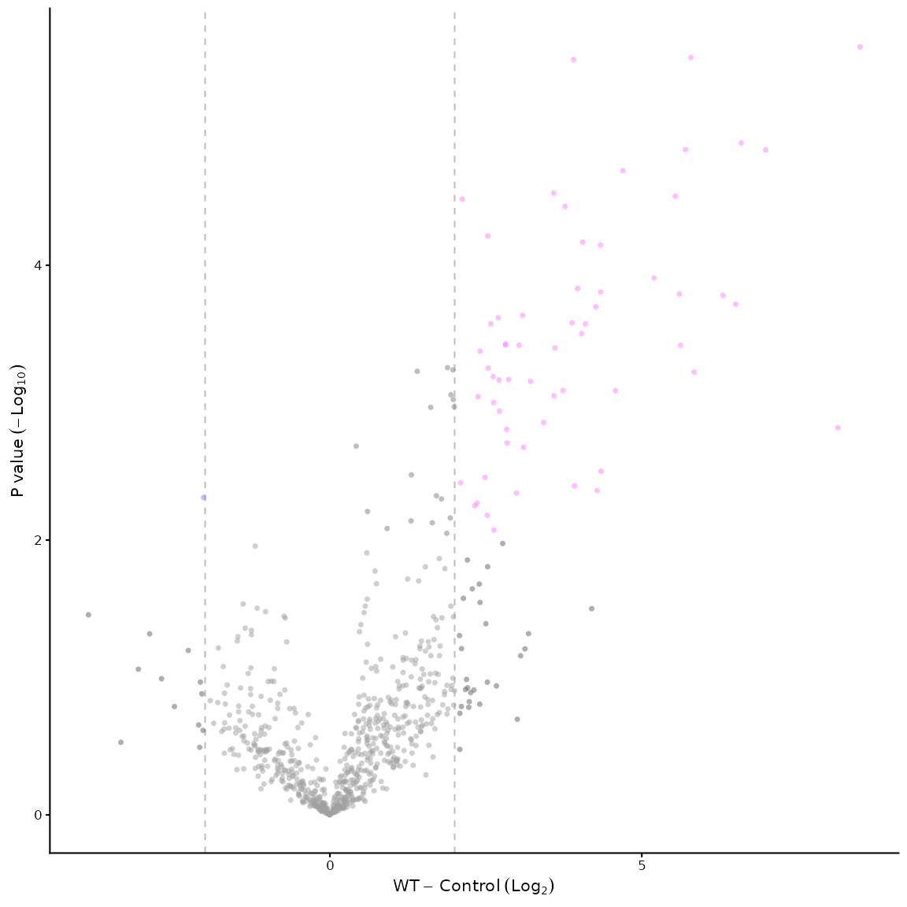
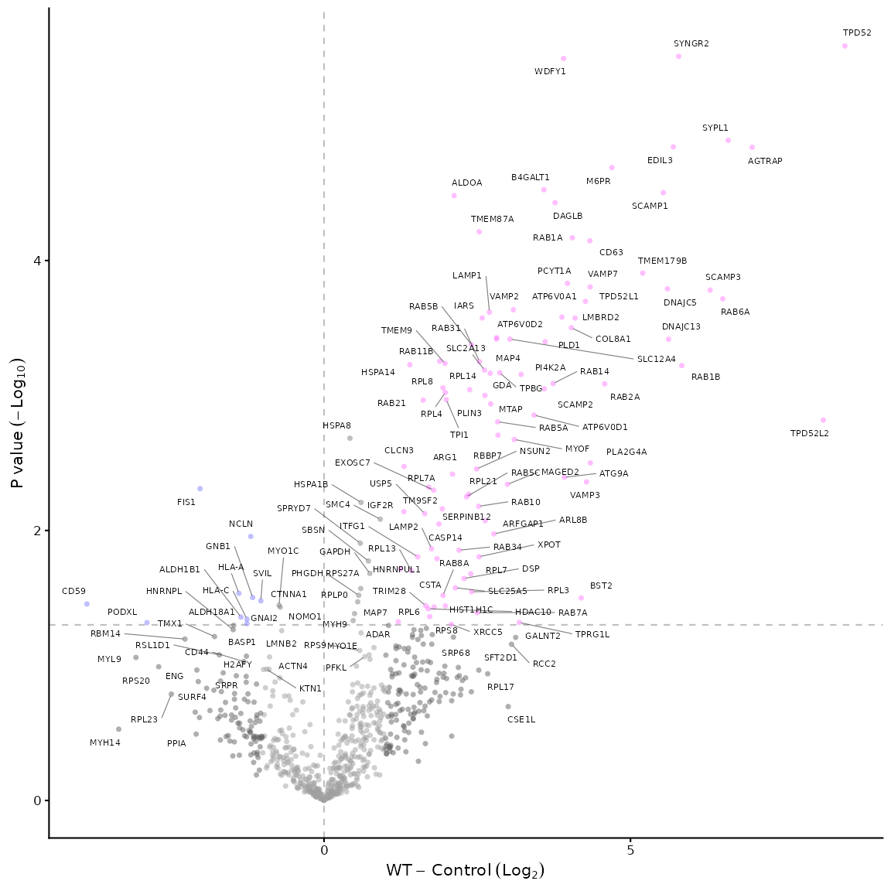
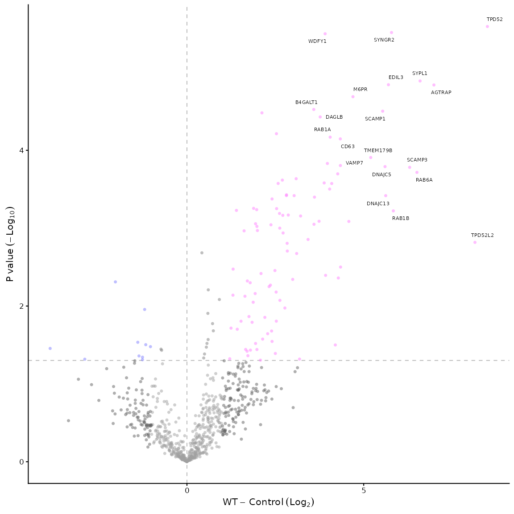
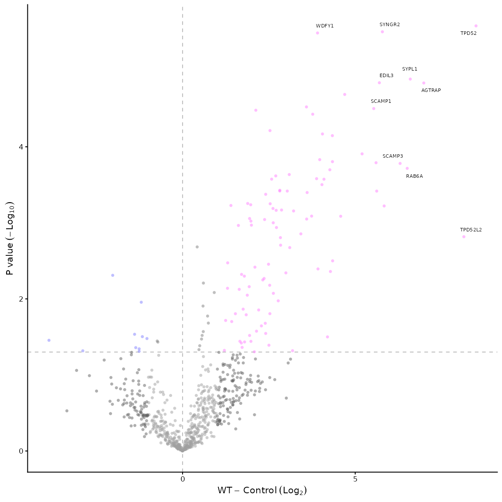
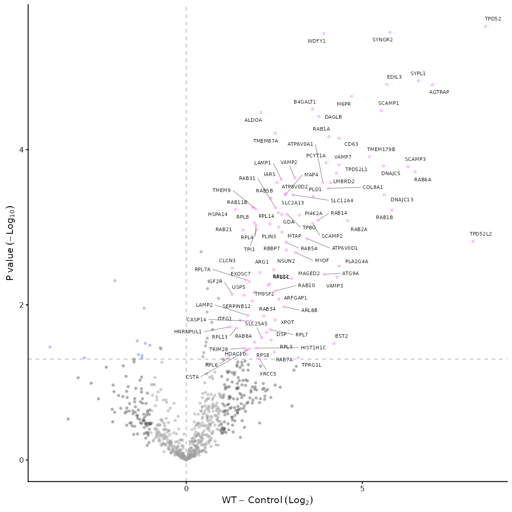
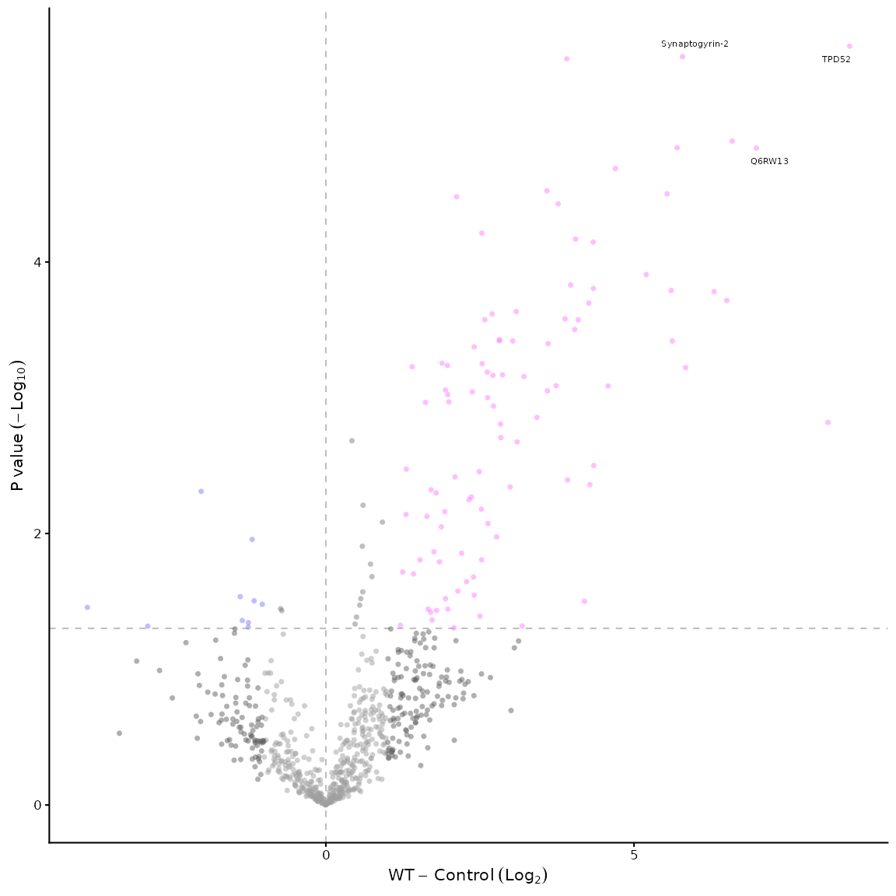
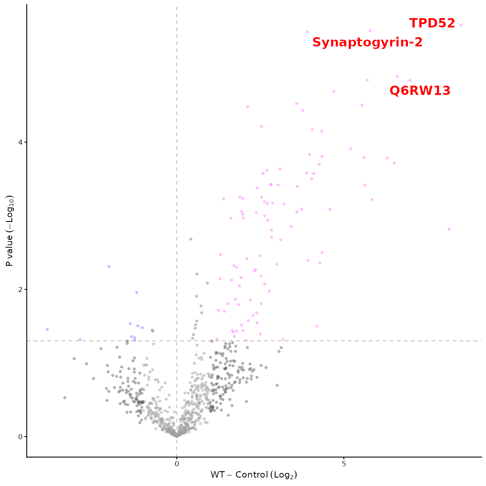

# Changing Volcano Plot Appearance

Virtually all aspects of the volcano plot can be customised. The main
customisations are listed here with examples, but other customisations
are possible, see the documentation for the
[`volcano_plot_maxquant()`](https://quantixed.github.io/VolcanoPlotR/reference/volcano_plot_maxquant.md)
function for more details.

## Changing colours

To change the colour of the points in the volcano plot, you can use the
`vp_colours` parameter of the
[`volcano_plot_maxquant()`](https://quantixed.github.io/VolcanoPlotR/reference/volcano_plot_maxquant.md)
function. The default colours are set to a specific palette, but you can
change them to any colours you like.

``` r

library(VolcanoPlotR)
# load and process the example file
filepath <- system.file("extdata", "proteinGroups.txt", package = "VolcanoPlotR")
# get the filename from the path
filename <- basename(filepath)
# get the directory name
filedir <- dirname(filepath)
df <- load_maxquant(file = filename, datadir = filedir)
df <- process_maxquant(df, group1 = "WT", group2 = "Control")
#> Using specified groups: WT versus Control
volcano_plot_maxquant(df, vp_colours = c("0" = "#a0a0a0", "1" = "#808080",
                                         "2" = "#606060", "3" = "#00ddff",
                                         "4" = "#606060", "5" = "#ff0000"))
```



The first thing to understand is how the volcano plot is divided into
“sectors”. The sectors are defined by the thresholds for p-value and
fold change. The default thresholds are 0.05 for p-value and 1 for fold
change, which divides the plot into 6 sectors (named 0 to 5). The
sectors are defined as follows:

- Sector 0: p \> 0.05 and \|log2FC\| \< 1
- Sector 1: p \<= 0.05 and \|log2FC\| \< 1
- Sector 2: p \> 0.05 and log2FC \<= -1
- Sector 3: p \<= 0.05 and log2FC \<= -1
- Sector 4: p \<= 0.05 and log2FC \>= 1
- Sector 5: p \> 0.05 and log2FC \>= 1

To visualise this:



Knowing which sectors you’d like to colour differently, you can then
specify the colours for each sector using the `vp_colours` parameter of
the
[`volcano_plot_maxquant()`](https://quantixed.github.io/VolcanoPlotR/reference/volcano_plot_maxquant.md)
function. The colours are specified as a named vector, where the names
correspond to the sector numbers (0 to 5) and the values are the colours
you want to use.

Another example of changing the colours of the points in the volcano
plot is shown below. We also alter the alpha, size and shape of the
points.

``` r

volcano_plot_maxquant(df, vp_colours = c("0" = "#a0a000", "1" = "#808080",
                                         "2" = "#606060", "3" = "#00dd80",
                                         "4" = "#606060", "5" = "#800080"),
                      point_args = list(size = 2,
                                        shape = 15,
                                        alpha = 0.8))
```



### Changing thresholds

A related concept is changing the thresholds for p-value and fold
change. This can be done using the `threshold_p` and `threshold_fc`
parameters of the
[`volcano_plot_maxquant()`](https://quantixed.github.io/VolcanoPlotR/reference/volcano_plot_maxquant.md)
function. The default thresholds are 0.05 for p-value and 1 for fold
change, but you can change them to any values you like.

The colouring will automatically be adjusted and the lines to demarcate
the plots can be modified using the `p_line`, `zero_line` and `x_line`
parameters of the
[`volcano_plot_maxquant()`](https://quantixed.github.io/VolcanoPlotR/reference/volcano_plot_maxquant.md)
function.

``` r

volcano_plot_maxquant(df, threshold_p = 0.01,
                                  threshold_fc = 2,
                                  p_line = FALSE,
                                  zero_line = FALSE,
                                  x_line = TRUE)
```



## Labelling proteins of interest

Adding labels to proteins of interest is done using the `label_points`
parameter of the
[`volcano_plot_maxquant()`](https://quantixed.github.io/VolcanoPlotR/reference/volcano_plot_maxquant.md)
function. The default is to label no points, but you can label all
points, the top n points, the top n points in a specific sector, or
specify proteins of interest to label.

``` r

# rather than the default: volcano_plot_maxquant(df) we will (try to) label all proteins
volcano_plot_maxquant(df, label_points = "all")
```



``` r

# or we can label the top 20
volcano_plot_maxquant(df, label_points = "top_20")
```



``` r

# or we can label the top 10 proteins in sector 5 only
volcano_plot_maxquant(df, label_points = "5_10")
```



``` r

# labelling all proteins in sector 5 is done like this
volcano_plot_maxquant(df, label_points = "5_all")
```



``` r

# to label specific proteins we can use a character vector of protein names, e.g.
volcano_plot_maxquant(df, label_points = c("TPD52", "Q6RW13", "Synaptogyrin-2"))
```



``` r

# they can be either a Gene.names, Protein.names, Protein.ID or a mix but whatever value you give will be used to label the protein. Note, it must be an exact match.
# if you'd like to customise the labels, you can pass a list of arguments to the label_args parameter, e.g.
volcano_plot_maxquant(df, label_points = c("TPD52", "Q6RW13", "Synaptogyrin-2"), label_args = list(size = 4, colour = "red", fontface = "bold"))
```


