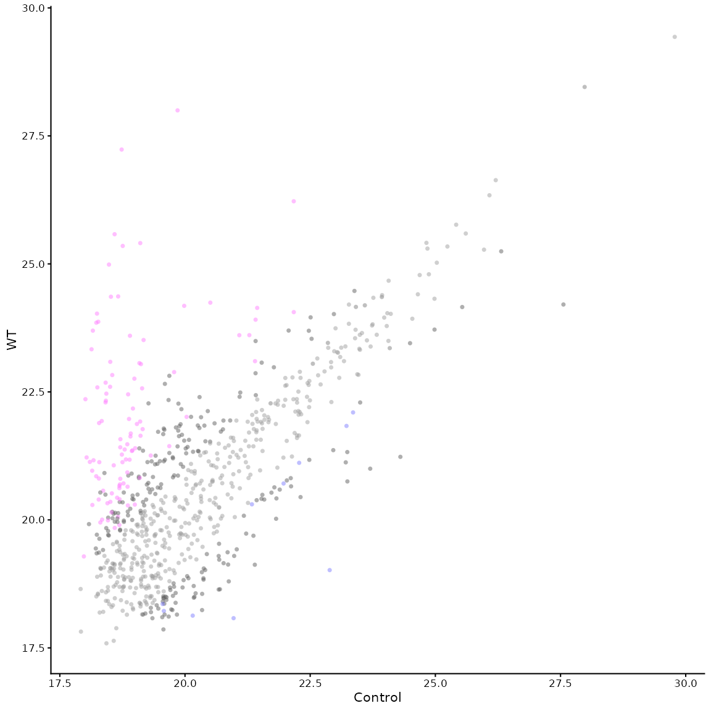
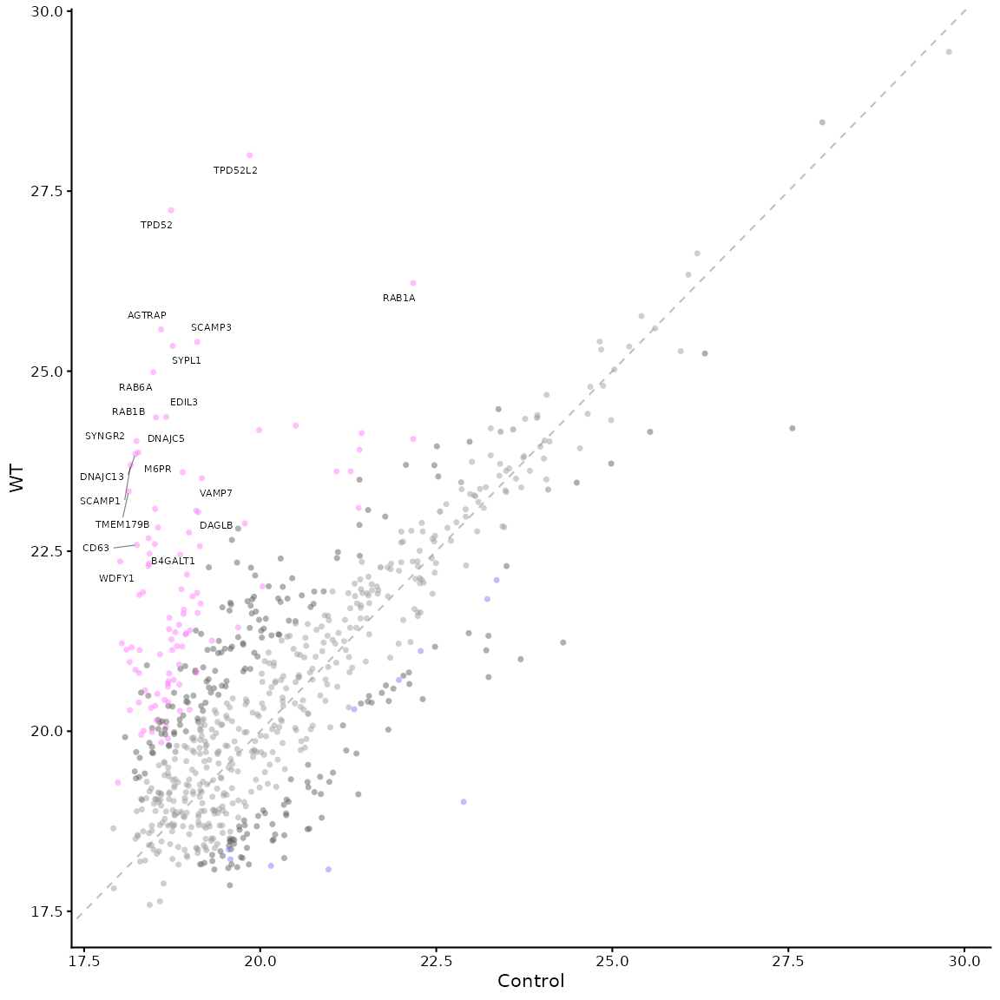
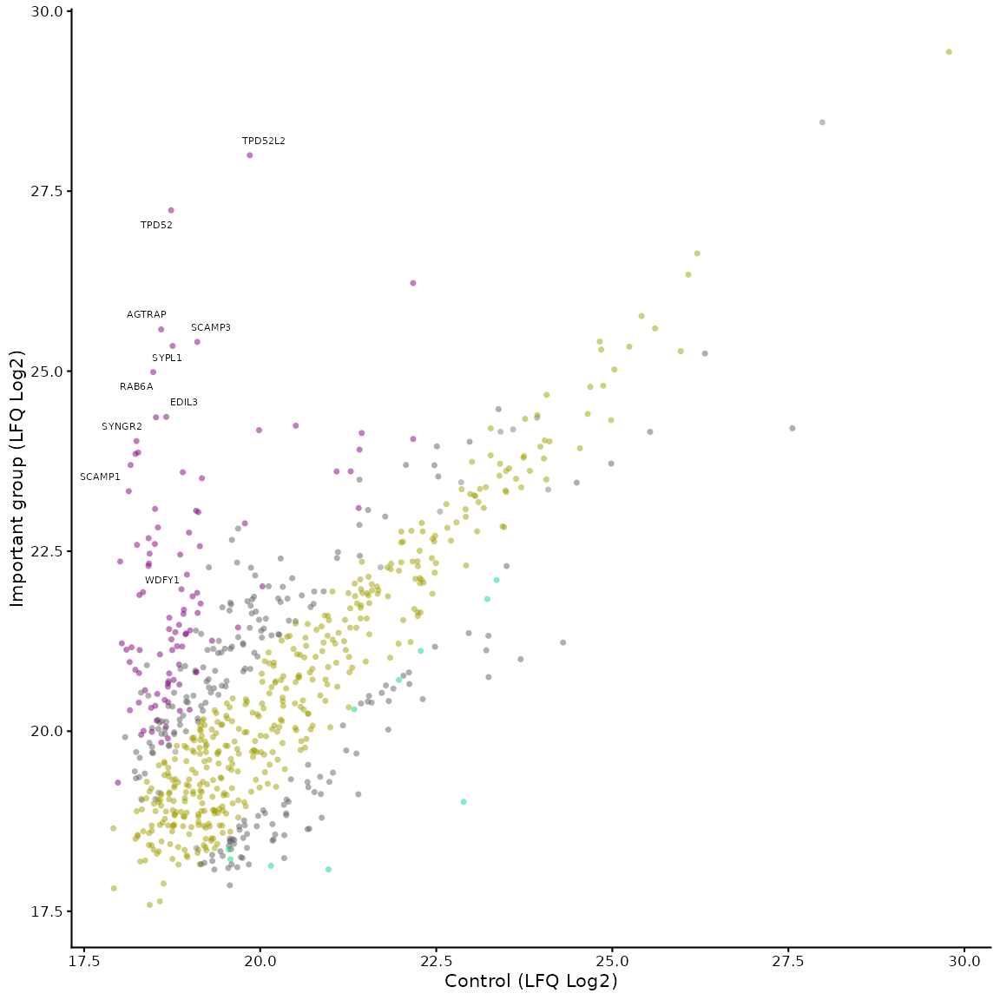
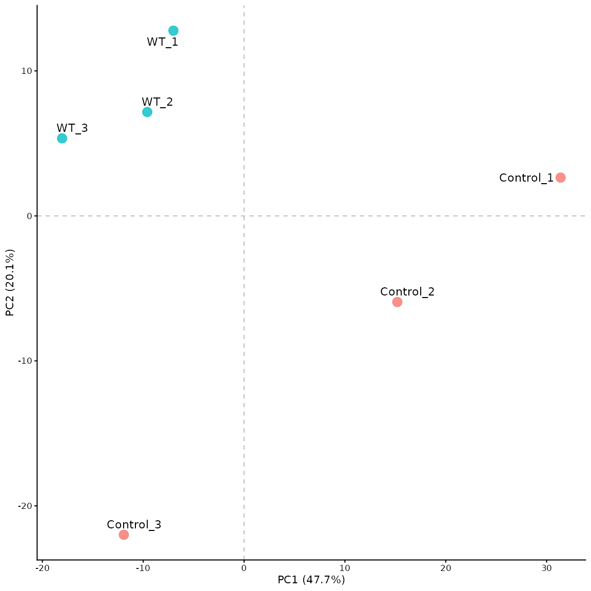
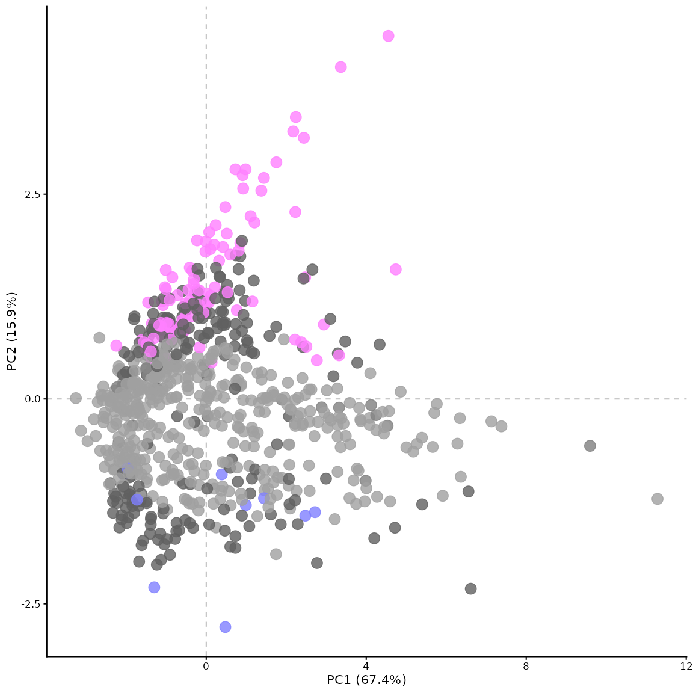

# Outputs from VolcanoPlotR

The main output is obviously, the volcano plot itself, which is returned
as a ggplot object from the
[`volcano_plot_maxquant()`](https://quantixed.github.io/VolcanoPlotR/reference/volcano_plot_maxquant.md)
function. This can be customised further using ggplot2 functions, but
there are other outputs that can be generated from the MaxQuant data.

## Text output

To generate a text output of the enriched proteins, you can set the
`text_output` parameter to `TRUE` in the
[`volcano_plot_maxquant()`](https://quantixed.github.io/VolcanoPlotR/reference/volcano_plot_maxquant.md)
function. This will generate a text file containing the enriched
proteins and their associated statistics. The output is saved as a
tab-separated text file in the `text_output_dir` directory (default is
“Output/Data/”).

It contains a ranked list of proteins where the ranking is calculated by
the manhattan distance from the origin (0,0) in the volcano plot. This
list can be useful for other applications or for generating a table for
publication.

## Alternative processing and statistical tests

### Changing the processing of MaxQuant data

By default,
[`process_maxquant()`](https://quantixed.github.io/VolcanoPlotR/reference/process_maxquant.md)
will analysis LFQ intensity values. To use a different measurement, the
`meas` parameter can be set to one of the other measurements in the
MaxQuant output (e.g. “iBAQ”, “Intensity”, “MS/MS.counts”).

The `baseval` parameter can be set to a value other than 0 to use a
different base value for log2 transformation. The `width` and
`downshift` parameters can be set to different values to change the
imputation of missing values. The `seed` parameter can be set to a
different value to change the random seed used for imputation.

### Statistical tests

The standard method for calculating p-values is via an unpaired two
sample t-test assuming equal variance. To change to paired t-test, you
can set the `paired` parameter to `TRUE` in the
[`process_maxquant()`](https://quantixed.github.io/VolcanoPlotR/reference/process_maxquant.md)
function, similarly the `var.equal` parameter can be set to `FALSE` to
use Welch’s t-test instead of Student’s t-test. The default settings
mirror Perseus processing.

## Other plots

### Mean vs Mean plot

The function
[`mean_plot_maxquant()`](https://quantixed.github.io/VolcanoPlotR/reference/mean_plot_maxquant.md)
can be used to generate a mean vs mean plot of the two groups being
compared. This is useful for visualising the distribution of the data.

The plot is generated with similar parameters to the volcano plot. Some
examples are shown below:

``` r

library(VolcanoPlotR)
# get the path to the proteinGroups.txt file included in the package
filepath <- system.file("extdata", "proteinGroups.txt", package = "VolcanoPlotR")
# get the filename from the path
filename <- basename(filepath)
# get the directory name
filedir <- dirname(filepath)
df <- load_maxquant(file = filename, datadir = filedir)
df <- process_maxquant(df, group1 = "WT", group2 = "Control")
#> Using specified groups: WT versus Control
# now we can generate the mean vs mean plot
mean_plot_maxquant(df)
```



``` r

# we can add a line to show the diagonal and start to label points
mean_plot_maxquant(df, xy_line = TRUE, label_points = "top_20")
```



``` r

# the parameters are the same as for the volcano plot, so we can change the colours and labels
mean_plot_maxquant(df, label_points = "5_10",
                   x_label = "Control (LFQ Log2)",
                   y_label = "Important group (LFQ Log2)",
                   vp_colours = c("0" = "#a0a000", "1" = "#808080",
                                  "2" = "#606060", "3" = "#00dd80",
                                  "4" = "#606060", "5" = "#800080"))
```



### PCA plot

This can be generated using the
[`pca_plot_maxquant()`](https://quantixed.github.io/VolcanoPlotR/reference/pca_plot_maxquant.md)
function. The PCA plot by default shows a comparison between runs
(experimental repeats), rather than between proteins.

``` r

# pca of the experimental repeats
pca_plot_maxquant(df)
```



Using the `by_protein` parameter, the PCA can be generated for the
proteins instead of the experimental repeats. In this case, the points
are coloured by significance based on the p-value and fold change
thresholds. The settings for this plot can be adjusted in similar ways
as for the volcano plot and the mean vs mean plot.

``` r

# pca of the proteins, coloured by significance
pca_plot_maxquant(df, by_protein = TRUE)
```


